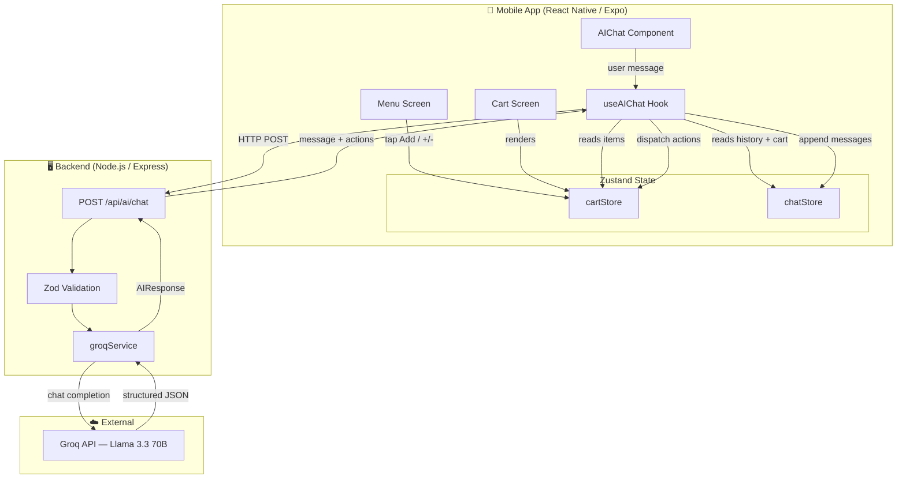
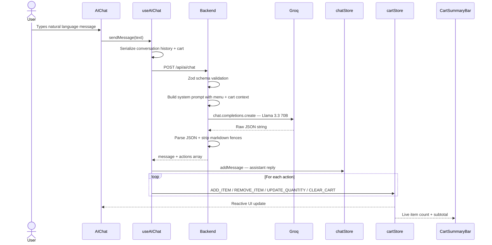

<div align="center">

# Le Bistro

### AI-Powered Restaurant Ordering App

*A conversational AI waiter that lets you order in plain English*


*Built for the Viridien AI Full-Stack Engineering Internship Challenge*

</div>

---

## Table of Contents

- [Overview](#overview)
- [Tech Stack](#tech-stack)
- [Key Features](#key-features)
- [Architecture](#architecture)
- [AI Request Flow](#ai-request-flow)
- [Project Structure](#project-structure)
- [Getting Started](#getting-started)
- [Running the App](#running-the-app)
- [Connecting Your Device](#connecting-your-device)
- [API Reference](#api-reference)
- [Author](#author)

---

## Overview

Le Bistro is a production-grade mobile restaurant ordering app where a conversational AI handles your entire order. Type naturally — *"Add two truffle arancini and a sparkling water"* — and the AI parses your intent, updates the cart in real time, and confirms the change in a friendly reply. Every interaction is backed by structured JSON actions dispatched directly to a reactive Zustand store, so the UI stays perfectly in sync.

---

## Tech Stack

| Layer      | Technology                                    |
|------------|-----------------------------------------------|
| Mobile     | React Native · Expo SDK 51 · Expo Router v3   |
| Styling    | NativeWind v4 (Tailwind CSS for React Native) |
| Animations | React Native Reanimated 3                     |
| State      | Zustand                                       |
| Backend    | Node.js · Express · TypeScript                |
| AI         | Groq API — Llama 3.3 70B Versatile            |
| Validation | Zod                                           |

---

## Key Features

| Feature | Description |
|---|---|
| **Conversational AI Waiter** | Natural language ordering powered by Llama 3.3 70B via Groq |
| **Structured JSON Actions** | AI parses intent and returns typed cart operations |
| **Live Cart Updates** | AI actions dispatch directly to Zustand — UI updates instantly |
| **Full Cart Management** | Add, remove, update quantity via both UI and AI |
| **Smooth Animations** | Spring-physics drawer, sheet transitions via Reanimated 3 |
| **Type-Safe End-to-End** | Strict TypeScript on both mobile and backend |
| **Validated API** | Zod schemas guard all backend inputs |
| **Graceful Error Handling** | Network failures and malformed AI responses never crash the app |

---

## Architecture

> System overview — how the mobile app, backend, and Groq API are connected.



---

## AI Request Flow

> Step-by-step sequence from user input to cart update.



### AI Response Format

The AI always returns a structured JSON object — never free text:

```json
{
  "message": "I've added 2 Truffle Arancini to your cart!",
  "actions": [
    { "type": "ADD_ITEM", "itemId": "item-01", "quantity": 2 }
  ]
}
```

**Supported action types:** `ADD_ITEM` · `REMOVE_ITEM` · `UPDATE_QUANTITY` · `CLEAR_CART`

---

## Project Structure

```
le-bistro/
├── apps/
│   ├── mobile/                  # Expo React Native app
│   │   ├── app/
│   │   │   ├── _layout.tsx      # Root layout
│   │   │   └── (tabs)/          # Menu + Cart tab screens
│   │   ├── components/          # MenuCard, CartItem, AIChat, Toast …
│   │   ├── store/               # Zustand — cartStore, chatStore
│   │   ├── hooks/               # useAIChat
│   │   ├── data/                # Menu items
│   │   ├── constants/           # Theme, API config
│   │   ├── types/               # Shared TypeScript types
│   │   └── utils/               # Helpers (formatCurrency …)
│   └── backend/
│       └── src/
│           ├── controllers/     # handleChat request handler
│           ├── routes/          # Express route definitions
│           ├── services/        # groqService — AI integration
│           ├── schemas/         # Zod validation schemas
│           ├── types/           # Shared types
│           └── data/            # Menu data (source of truth)
├── .gitignore
├── package.json                 # Root scripts — runs both services
└── README.md
```

---

## Getting Started

### Prerequisites

- Node.js v18 or higher
- npm v9 or higher
- [Expo Go](https://expo.dev/go?sdkVersion=51&platform=android&device=true) (SDK 51) on your phone **or** an Android emulator
- A free [Groq API key](https://console.groq.com)

### 1. Clone the repository

```bash
git clone <repo-url>
cd le-bistro
```

### 2. Install root dependencies

```bash
npm install
```

### 3. Configure the backend

```bash
cd apps/backend
npm install
cp .env.example .env
```

Open `apps/backend/.env` and fill in your key:

```env
GROQ_API_KEY=your_groq_api_key_here
PORT=3001
```

> Get a free key at [console.groq.com](https://console.groq.com)

### 4. Install mobile dependencies

```bash
cd ../mobile
npm install
cd ../..
```

---

## Running the App

### Option A — Both services at once (recommended)

```bash
npm run dev
```

Starts the backend on `:3001` and Metro bundler simultaneously.

### Option B — Run separately

**Terminal 1 — Backend**
```bash
cd apps/backend
npm run dev
```

**Terminal 2 — Mobile**
```bash
cd apps/mobile
npx expo start --clear
```

---

## Connecting Your Device

### Android Emulator

1. Open Android Studio → Device Manager → start an emulator
2. Press **`a`** in the Metro terminal — the app opens automatically

### Physical Android via USB

1. Enable **Developer Options** (tap Build Number 7 times)
2. Enable **USB Debugging**
3. Connect phone and run:

```bash
adb reverse tcp:8081 tcp:8081
adb reverse tcp:3001 tcp:3001
```

4. Open Expo Go → enter `exp://localhost:8081`

### Physical Android via WiFi

```bash
# Windows
$env:REACT_NATIVE_PACKAGER_HOSTNAME="your.local.ip"
npx expo start --clear
```

Then scan the QR code with Expo Go.

---

## API Reference

| Method | Endpoint     | Description                          |
|--------|--------------|--------------------------------------|
| `POST` | `/api/ai/chat` | Process natural language order input |
| `GET`  | `/health`      | Health check                         |

### `POST /api/ai/chat`

**Request body**

```json
{
  "message": "Add two spicy chicken sandwiches and a large water",
  "conversationHistory": [],
  "currentCart": []
}
```

**Response**

```json
{
  "message": "Added 2 Spicy Chicken Sandwiches and 1 Still Water!",
  "actions": [
    { "type": "ADD_ITEM", "itemId": "item-05", "quantity": 2 },
    { "type": "ADD_ITEM", "itemId": "item-09", "quantity": 1 }
  ]
}
```

---

## Author

**Prachi Gupta**
MSSE · San Jose State University
[prachigupta2610@gmail.com](mailto:prachigupta2610@gmail.com) &
[prachi.gupta01@sjsu.edu](mailto:prachi.gupta01@sjsu.edu)
